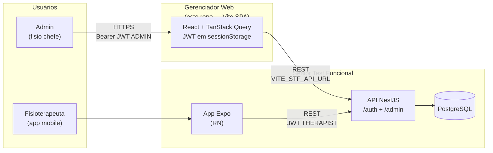

# STF Gerenciador Web

Painel web administrativo do **Sênior Teste Funcional (STF)** — plataforma mobile para fisioterapeutas acompanharem pacientes idosos com instrumentos funcionais padronizados.

Este repositório concentra o **gerenciador web**: interface para o fisioterapeuta **administrador** (chefe da equipe) supervisionar fisioterapeutas, pacientes e relatórios clínicos, sem as restrições de escopo do aplicativo mobile.

---

## Relação com o STF mobile

| Repositório | Caminho | Papel |
|-------------|---------|-------|
| **STF (mobile + API)** | [`../senior-test-funcional`](../senior-test-funcional) | App Expo, API NestJS, PostgreSQL, especificação clínica |
| **STF Gerenciador Web** | este repositório | Painel admin web que estende a API existente |

O gerenciador **não substitui** o app mobile. Ele complementa o ecossistema com visão transversal e operações administrativas que o app, por design, não oferece (isolamento por `therapist_id`).

Documentação canônica do produto base: [senior-test-funcional/docs/README.md](../senior-test-funcional/docs/README.md)

---

## Como funciona — diagrama e URLs

### Fluxo (visão geral)



> Diagrama detalhado e variantes: [docs/diagrams/system-context.md](docs/diagrams/system-context.md) · [docs/engineering/architecture.md](docs/engineering/architecture.md)

### Modelo de URLs

| Papel | Dev (local) | Produção (exemplo) |
|-------|-------------|---------------------|
| **Gerenciador web** | `http://localhost:5173` | `https://admin.seudominio.exemplo.com` |
| **API STF** | `http://localhost:3000` | `https://api.seudominio.exemplo.com` |
| **Health check** | `http://localhost:3000/health` | `https://api.seudominio.exemplo.com/health` |
| **Swagger (admin)** | `http://localhost:3000/api/docs` | `https://api.seudominio.exemplo.com/api/docs` |

**Variável no front:** `VITE_STF_API_URL` → URL da API **sem barra final** (ver [.env.example](.env.example)).

**CORS no STF** (`backend/.env`): incluir a origem do gerenciador — ex. `CORS_ORIGINS=http://localhost:5173` em dev.

### Autenticação (recarga F5)

```
Login POST /auth/login
  → user.role === ADMIN ?
       sim → sessionStorage.setItem('accessToken', …)  →  dashboard
       não → erro de acesso (não persiste token)
F5 / recarregar
  → token ainda em sessionStorage  →  continua logado
  → TanStack Query refaz fetch das listas
Logout
  → remove token + queryClient.clear()
```

Rotas admin consumidas pelo painel: **`/admin/*`** + **`/auth/*`** — spec em [docs/contracts/admin-api.md](docs/contracts/admin-api.md).

---

## Público-alvo do gerenciador

| Persona | Descrição |
|---------|-----------|
| **Admin (fisioterapeuta chefe)** | Supervisiona a equipe, redistribui pacientes, exclui registros e acessa qualquer relatório |
| **Fisioterapeuta comum** | Continua usando o **app mobile**; não é usuário primário deste painel |

---

## Capacidades principais

- Listar fisioterapeutas cadastrados e seus pacientes vinculados
- Visualizar dados completos de qualquer paciente
- Excluir pacientes (com confirmação e trilha de auditoria)
- **Transferir pacientes** entre fisioterapeutas — incluindo histórico de avaliações
- Excluir fisioterapeutas (com política de dados órfãos definida)
- Gerar e baixar **relatórios PDF** de qualquer paciente, **sem** a restrição de propriedade do app

---

## Documentação

Índice completo: **[docs/README.md](docs/README.md)**

| Tema | Onde |
|------|------|
| Visão de produto | [docs/product/overview.md](docs/product/overview.md) |
| PRD do gerenciador | [docs/product/PRD.md](docs/product/PRD.md) |
| Personas e papéis | [docs/product/personas-and-roles.md](docs/product/personas-and-roles.md) |
| Funcionalidades detalhadas | [docs/product/features.md](docs/product/features.md) |
| Regras de negócio | [docs/domain/business-rules.md](docs/domain/business-rules.md) |
| Arquitetura | [docs/engineering/architecture.md](docs/engineering/architecture.md) |
| Integração com STF | [docs/engineering/integration-with-stf.md](docs/engineering/integration-with-stf.md) |
| **Endpoints admin (spec API)** | [docs/contracts/admin-api.md](docs/contracts/admin-api.md) |
| Stack oficial | [docs/engineering/stack.md](docs/engineering/stack.md) |
| Lacunas vs STF | [docs/engineering/gap-analysis-stf.md](docs/engineering/gap-analysis-stf.md) |
| Diagramas UML | [docs/diagrams/](docs/diagrams/) |

---

## Stack (decidida)

| Camada | Tecnologia |
|--------|------------|
| Frontend | Vite + React + TypeScript + React Router |
| Dados | TanStack Query + React Hook Form + Zod |
| UI kit | A definir — cores alinhadas ao mobile ([docs/engineering/theming.md](docs/engineering/theming.md)) |
| Sessão | JWT em `sessionStorage` (sobrevive F5) |
| Backend | API NestJS do STF + `AdminModule` ✅ (em `senior-test-funcional`) |

Detalhes: [docs/engineering/stack.md](docs/engineering/stack.md)

---

## Vínculo com o STF

Repositório **separado**, caminho local padrão: `../senior-test-funcional`.

- API e banco: STF  
- Código web admin: este repo  
- Análise cruzada STF × gerenciador: [docs/engineering/gap-analysis-stf.md](docs/engineering/gap-analysis-stf.md)

---

## Status

| Componente | Fase |
|------------|------|
| STF mobile + API | Produto real entregue (pós-MVP) |
| Documentação gerenciador | ✅ Completa |
| API admin no STF | ✅ Implementada — ver [gap-analysis-stf.md](docs/engineering/gap-analysis-stf.md) |
| Frontend Vite | Pendente — scaffold |

---

## Próximos passos

1. Scaffold Vite + login (`sessionStorage`) + tokens visuais
2. Telas GW002–GW009 consumindo `/admin/*`
3. Configurar `CORS_ORIGINS` no STF ao deployar o front
