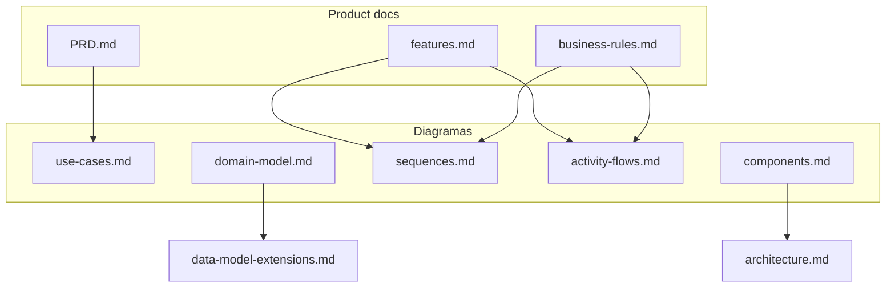

# Diagramas UML

Índice dos diagramas do STF Gerenciador Web. Renderizados em **Mermaid** (compatível com GitHub, VS Code, Cursor).

---

## Índice

| Diagrama | Tipo UML | Arquivo |
|----------|----------|---------|
| Contexto do sistema | C4 / Context | [system-context.md](system-context.md) |
| Casos de uso | Use Case | [use-cases.md](use-cases.md) |
| Modelo de domínio | Class Diagram | [domain-model.md](domain-model.md) |
| Sequência (fluxos) | Sequence | [sequences.md](sequences.md) |
| Atividades (fluxos) | Activity | [activity-flows.md](activity-flows.md) |
| Componentes | Component | [components.md](components.md) |
| Estados (paciente admin) | State | [state-machines.md](state-machines.md) |

---

## Visão integrada

---

## Como ler

1. Comece por [system-context.md](system-context.md) — onde o gerenciador se encaixa no ecossistema STF
2. [use-cases.md](use-cases.md) — o que o admin pode fazer
3. [domain-model.md](domain-model.md) — entidades e relações
4. [sequences.md](sequences.md) e [activity-flows.md](activity-flows.md) — fluxos detalhados
