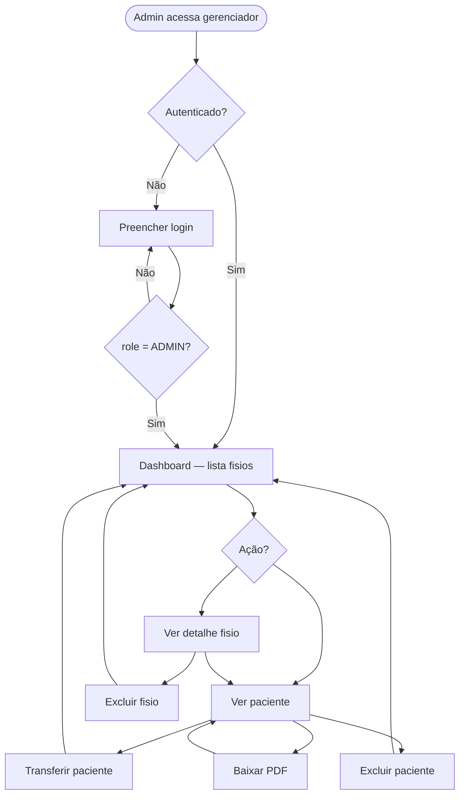
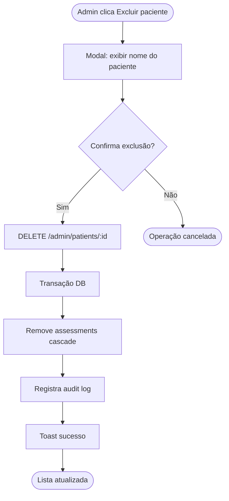
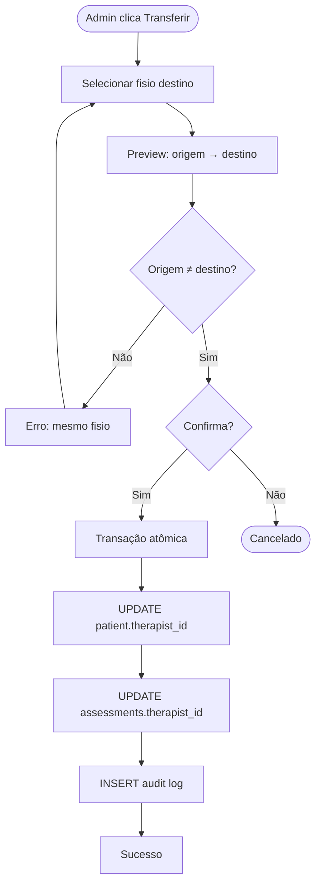
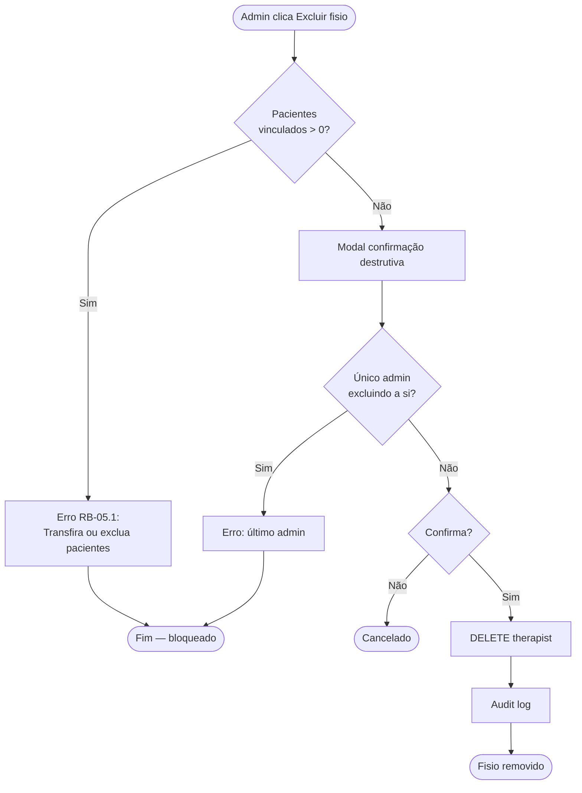
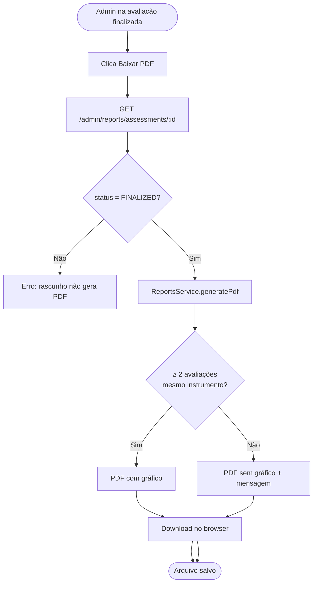
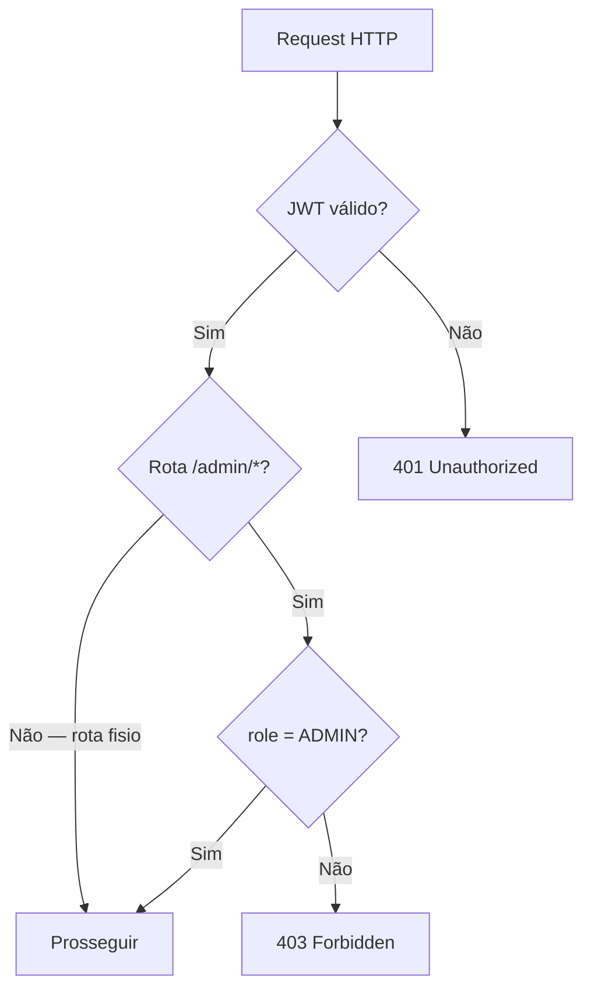

# Diagramas de atividade

Fluxos de processo do gerenciador web.

---

## Fluxo geral do admin

---

## Excluir paciente

---

## Transferir paciente

---

## Excluir fisioterapeuta

---

## Baixar relatório PDF

---

## Decisão de acesso (guard)

---

## Referências

- [../domain/business-rules.md](../domain/business-rules.md)
- [sequences.md](sequences.md)
