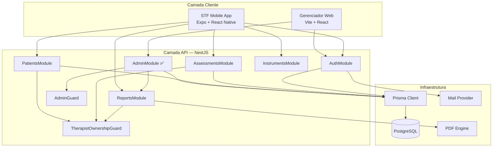
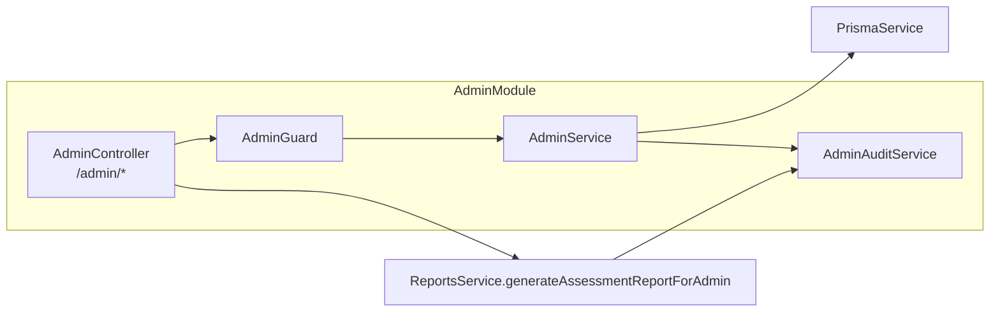
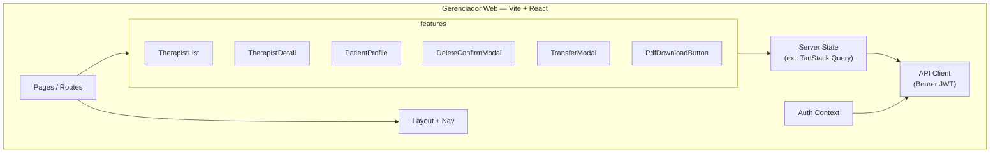
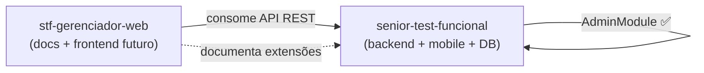

# Diagrama de componentes

Componentes de software do ecossistema com foco no gerenciador.

---

## Componentes — visão completa

---

## AdminModule — detalhe interno (STF)

---

## Gerenciador Web — componentes front (conceitual)

---

## Dependências entre repos

---

## Referências

- [../engineering/architecture.md](../engineering/architecture.md)
- [../engineering/integration-with-stf.md](../engineering/integration-with-stf.md)
