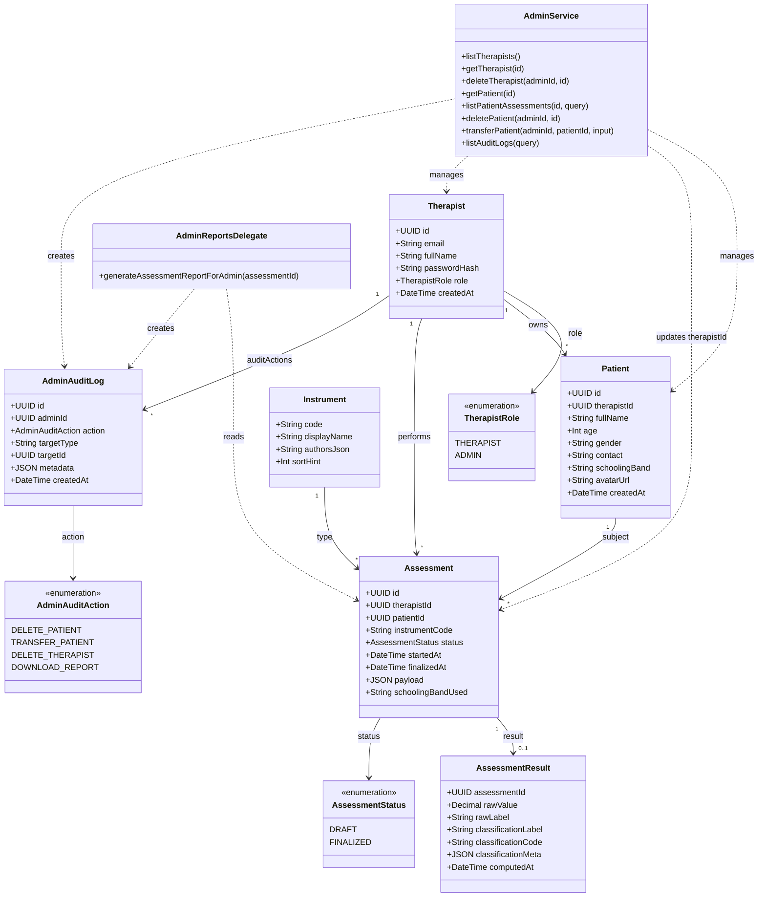
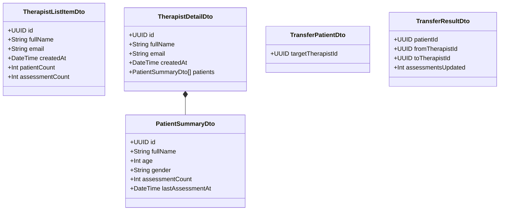
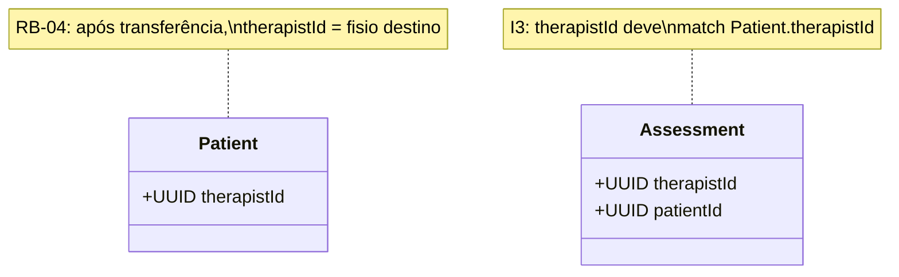

# Diagrama de classes (modelo de domínio)

Modelo conceitual estendido para o gerenciador web.

---

## Diagrama de classes UML

---

## DTOs de resposta (admin — conceitual)

---

## Invariantes de domínio

---

## Referências

- [../engineering/data-model-extensions.md](../engineering/data-model-extensions.md)
- [senior-test-funcional/docs/engineering/data-model.md](../../../senior-test-funcional/docs/engineering/data-model.md)
