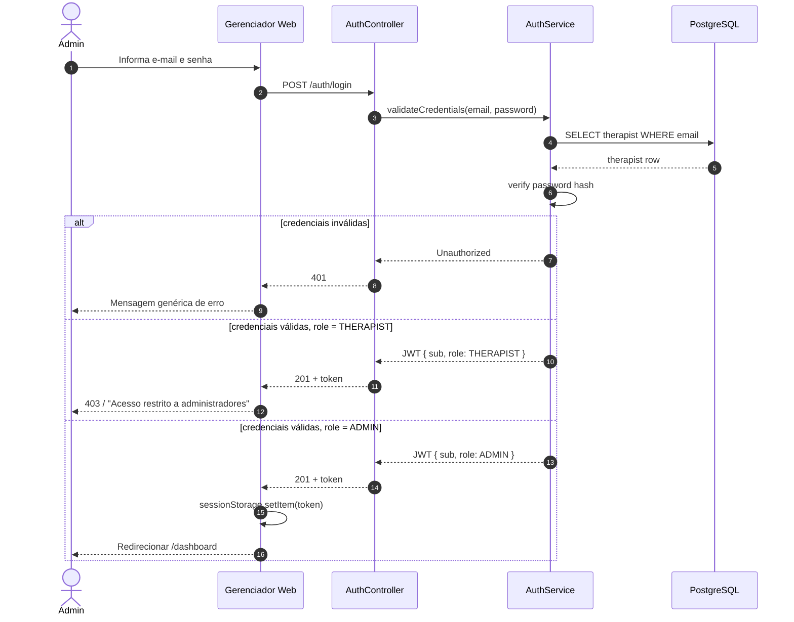
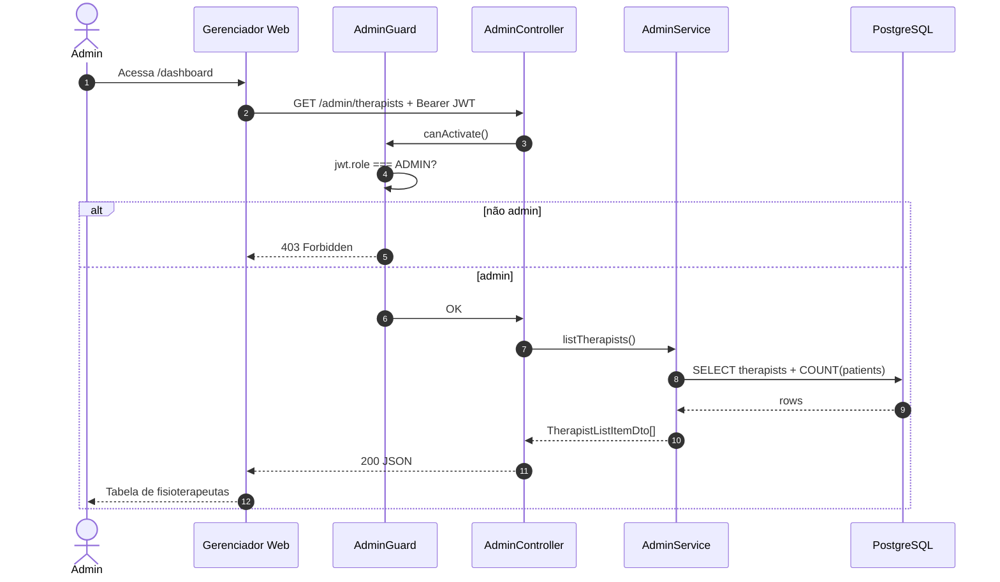
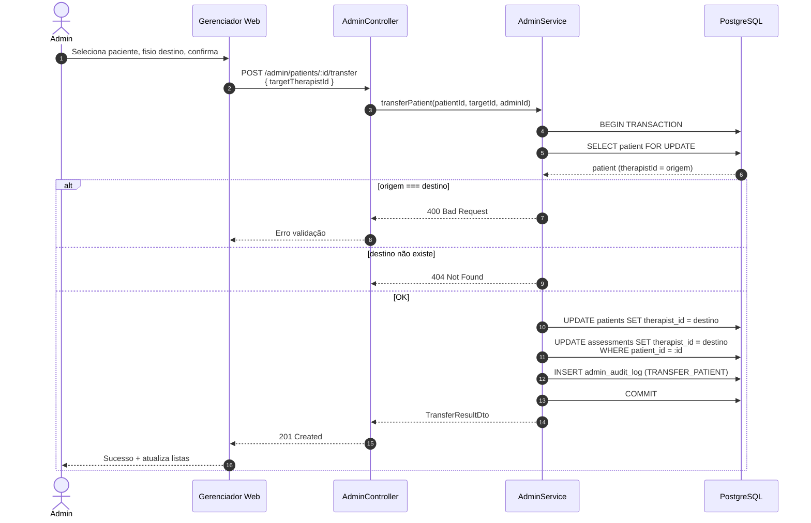
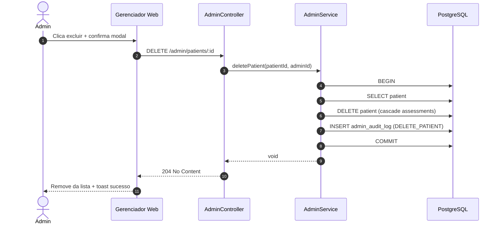
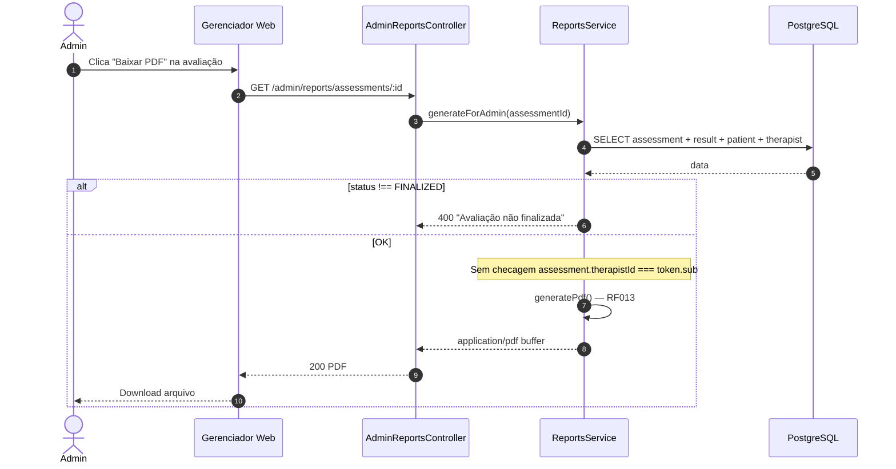
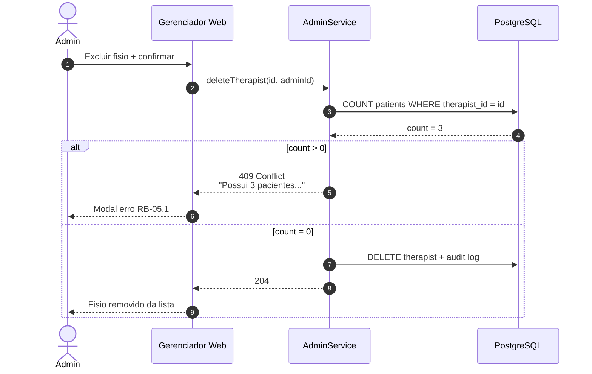
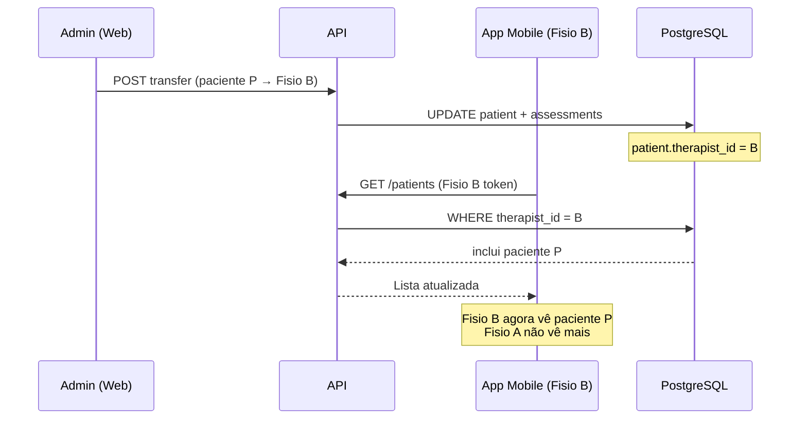

# Diagramas de sequência

Fluxos temporais principais do gerenciador web.

---

## GW001 — Login admin

---

## GW002 — Listar fisioterapeutas

---

## GW005 — Transferir paciente

---

## GW004 — Excluir paciente

---

## GW009 — Baixar PDF (sem restrição de ownership)

---

## GW006 — Excluir fisioterapeuta (bloqueio com pacientes)

---

## Interação pós-transferência — app mobile

---

## Referências

- [../product/features.md](../product/features.md)
- [activity-flows.md](activity-flows.md)
