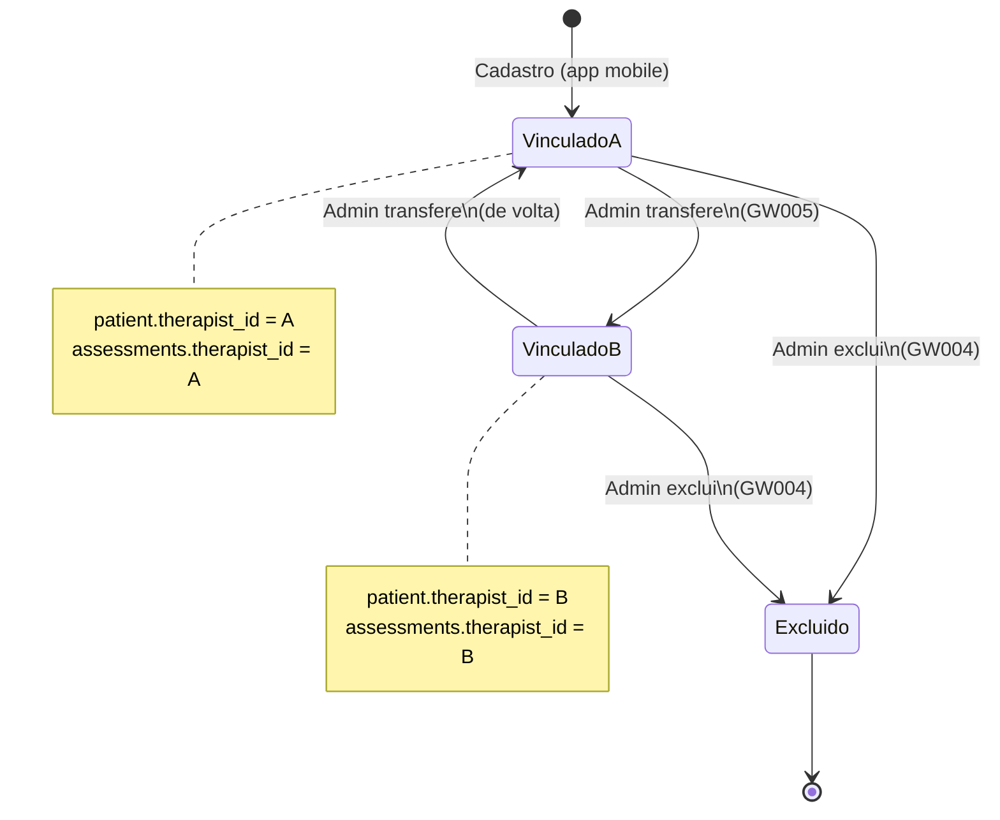
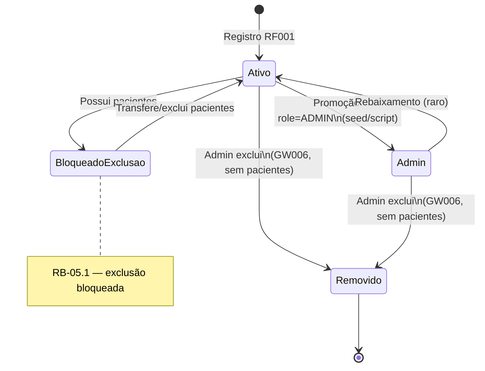
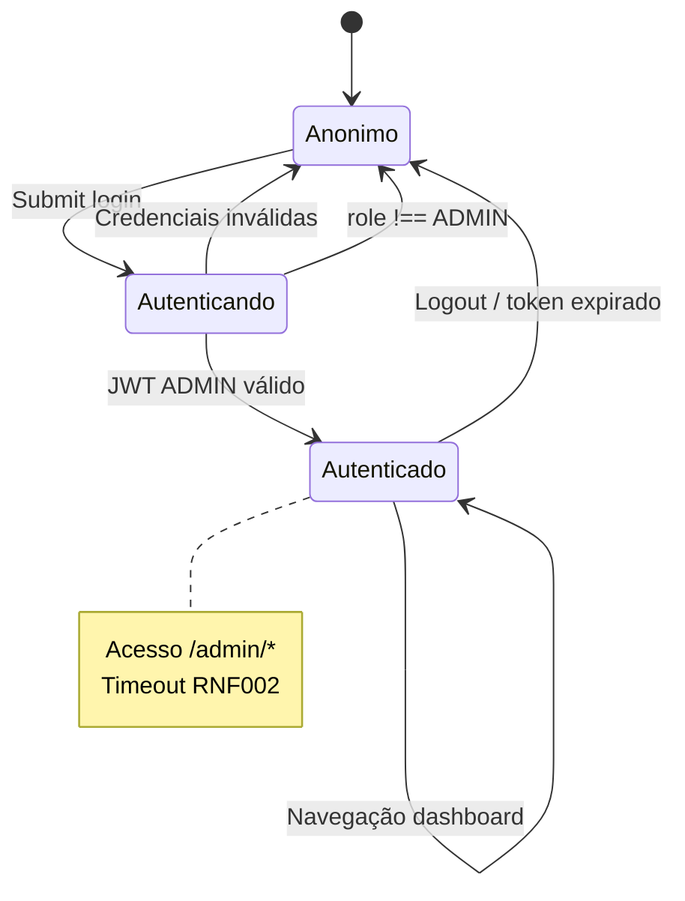
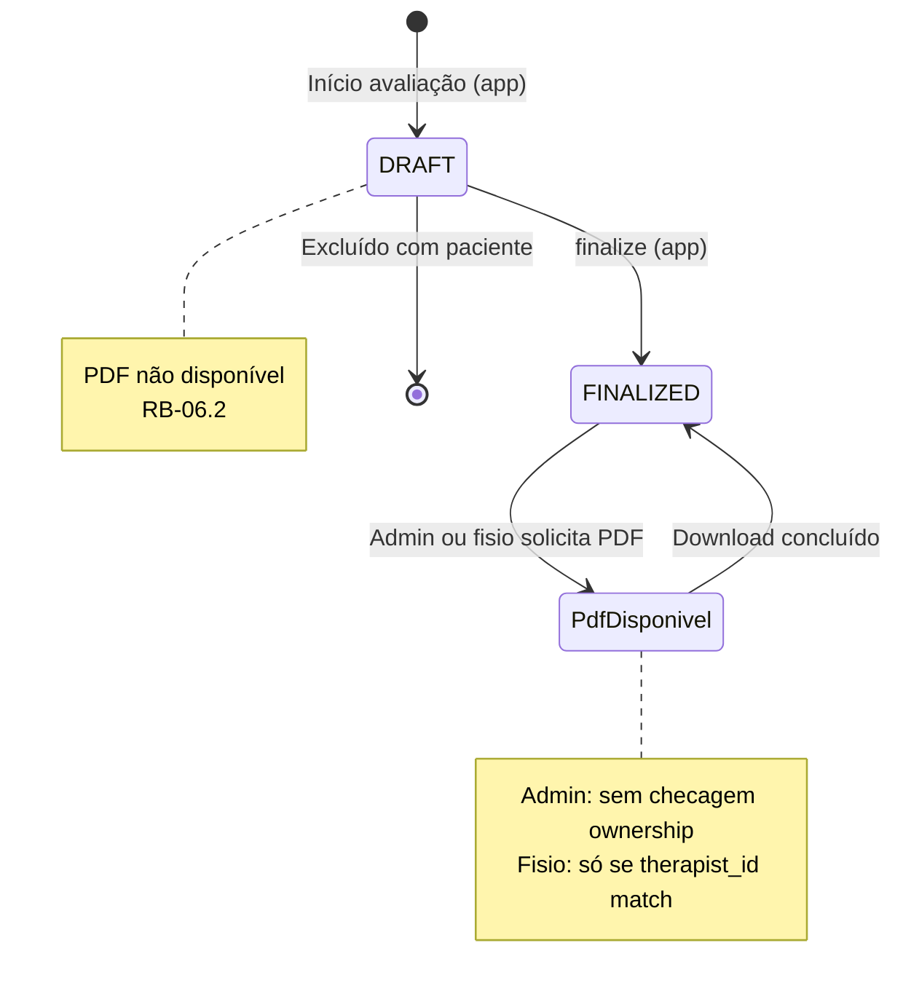
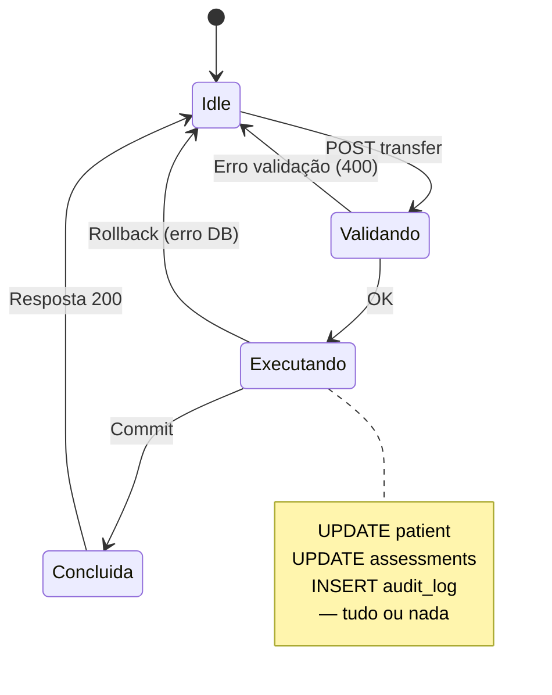

# Máquinas de estado

Estados relevantes para operações administrativas.

---

## Paciente — vínculo com fisioterapeuta

Estado do ponto de vista administrativo (quem é o responsável).

---

## Fisioterapeuta — conta

---

## Sessão admin (web)

---

## Avaliação — geração de PDF (perspectiva admin)

---

## Operação de transferência (transação)

---

## Referências

- [../domain/business-rules.md](../domain/business-rules.md)
- [activity-flows.md](activity-flows.md)
