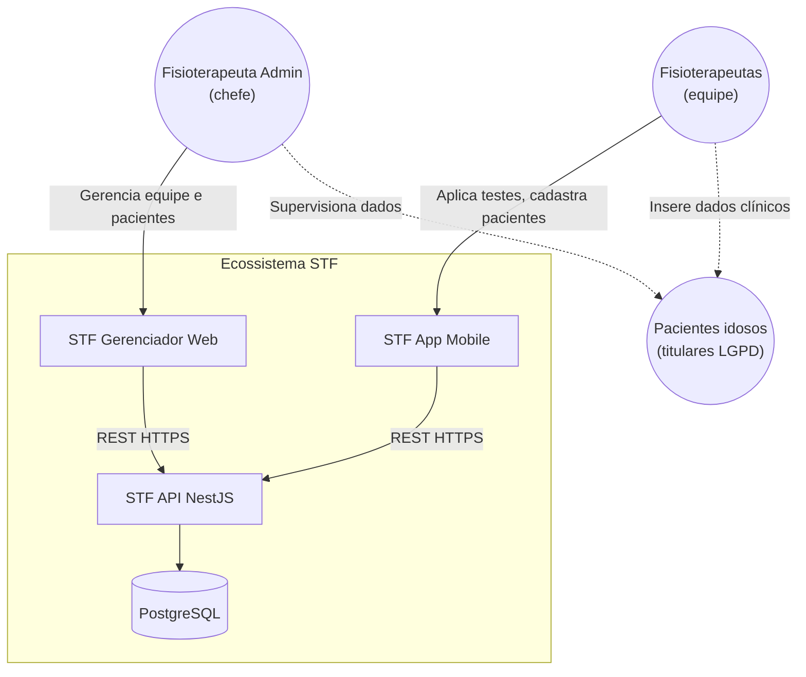
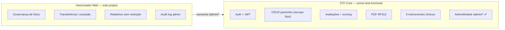
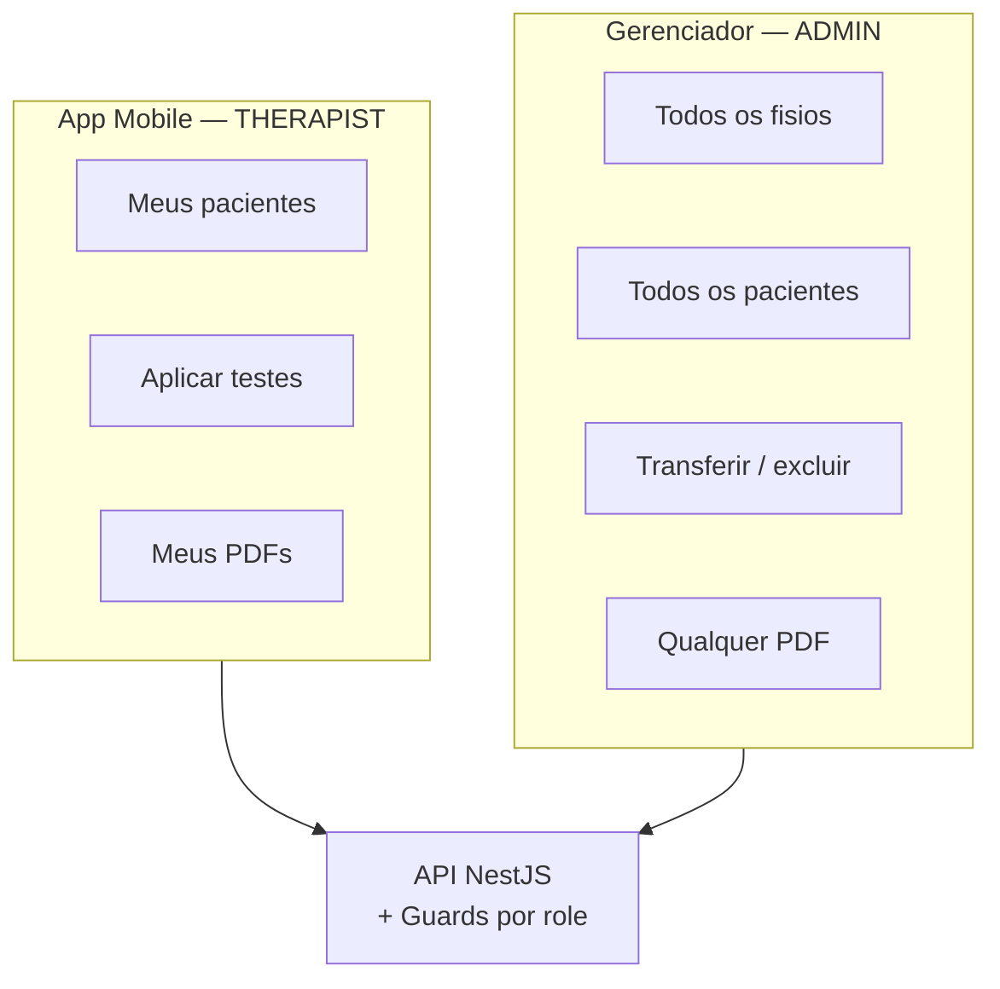

# Diagrama de contexto do sistema

Posicionamento do gerenciador web no ecossistema Sênior Teste Funcional.

---

## Contexto (C4 — Level 1)

---

## Fronteiras de responsabilidade

---

## Comparativo de escopo por canal

---

## Referências

- [../product/overview.md](../product/overview.md)
- [../contracts/admin-api.md](../contracts/admin-api.md)
