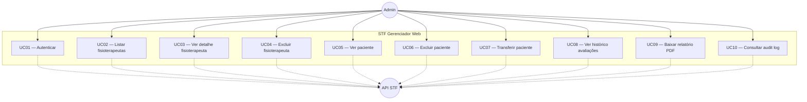
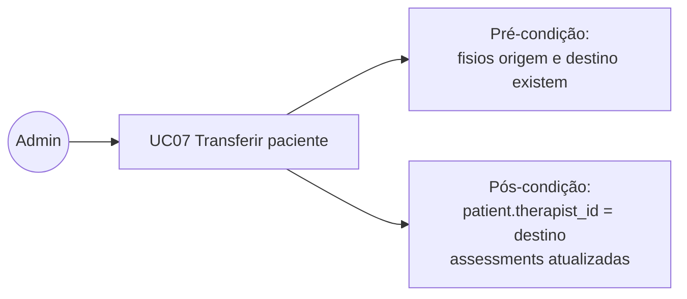
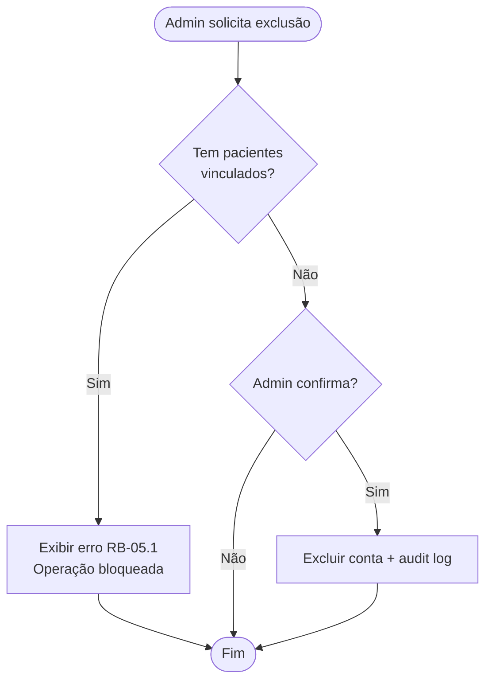

# Diagrama de casos de uso

Atores e casos de uso do gerenciador web.

---

## Atores

| Ator | Descrição |
|------|-----------|
| **Admin (Fisioterapeuta Chefe)** | Usuário primário do gerenciador |
| **Sistema STF (API)** | Ator secundário — executa persistência e PDF |
| **Fisioterapeuta Comum** | Ator externo — interage via app, afetado por transferências |

---

## Diagrama principal

---

## Mapa UC → GW (requisitos)

| UC | GW | Nome |
|----|-----|------|
| UC01 | GW001 | Autenticar admin |
| UC02 | GW002 | Listar fisioterapeutas |
| UC03 | GW003 | Ver detalhe fisioterapeuta |
| UC04 | GW006 | Excluir fisioterapeuta |
| UC05 | GW007 | Ver paciente |
| UC06 | GW004 | Excluir paciente |
| UC07 | GW005 | Transferir paciente |
| UC08 | GW008 | Ver histórico |
| UC09 | GW009 | Baixar PDF |
| UC10 | GW010 | Audit log |

---

## UC07 — Transferir paciente (detalhe)

**Fluxo principal:**
1. Admin seleciona paciente na lista do fisio origem
2. Escolhe fisio destino
3. Confirma transferência
4. Sistema atualiza banco em transação
5. Sistema registra audit log

**Fluxo alternativo — mesma origem/destino:** sistema exibe erro, cancela operação.

---

## UC04 — Excluir fisioterapeuta (detalhe)

---

## O que o admin **não** faz (fora dos casos de uso)

| Ação | Canal correto |
|------|---------------|
| Aplicar teste clínico | App mobile |
| Cadastrar paciente (MVP) | App mobile |
| Editar resultado de avaliação | Fora do escopo |
| Recuperar senha de outro fisio | Fluxo RF003 individual |

---

## Referências

- [../product/features.md](../product/features.md)
- [../domain/business-rules.md](../domain/business-rules.md)
