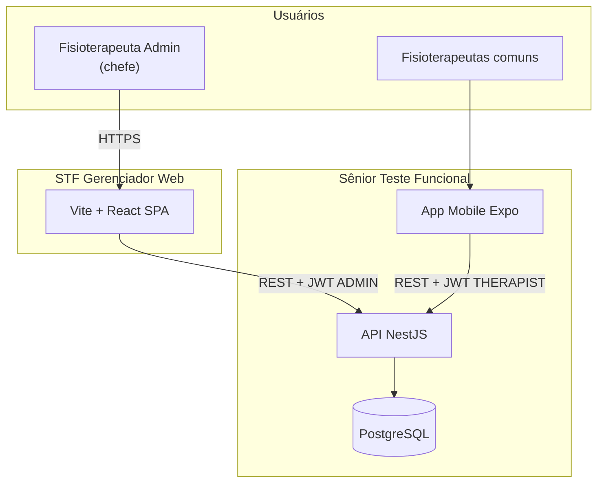
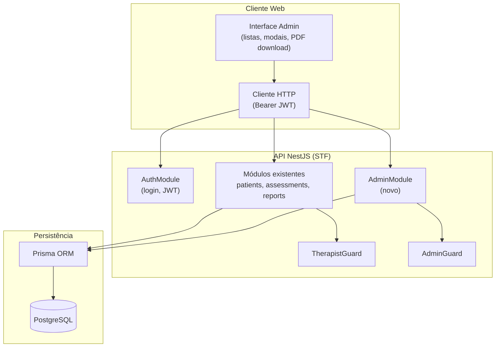
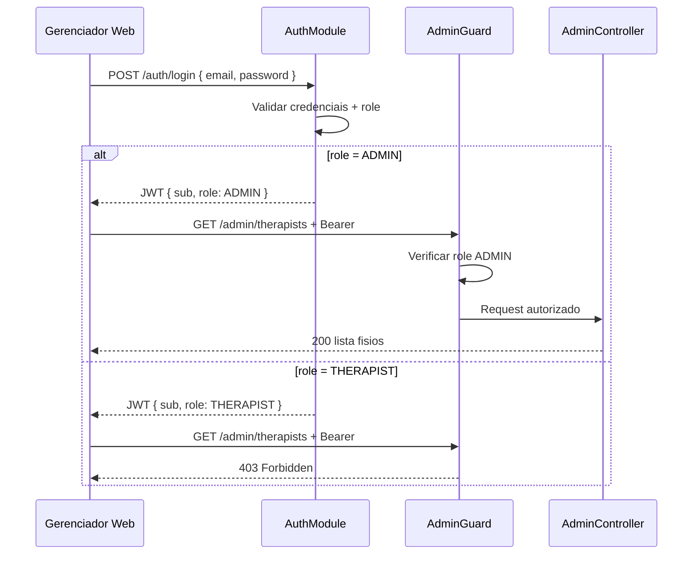
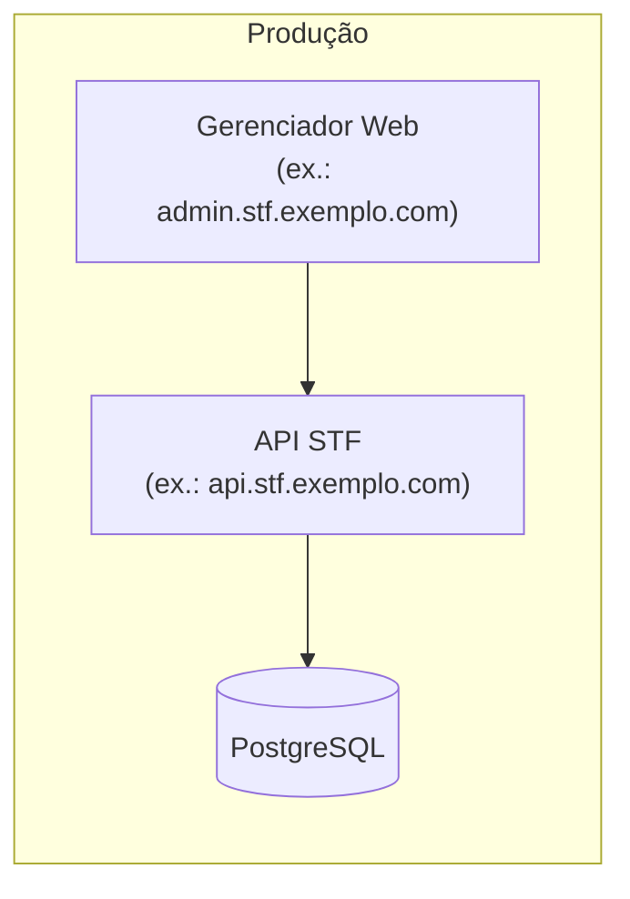

# Arquitetura — STF Gerenciador Web

**Status:** stack **decidida** — ver [stack.md](stack.md)  
**Alinhamento:** [senior-test-funcional/docs/engineering/architecture.md](../../senior-test-funcional/docs/engineering/architecture.md)  
**Lacunas API:** [gap-analysis-stf.md](gap-analysis-stf.md)

---

## 1. Princípios

| Princípio | Aplicação |
|-----------|-----------|
| **API STF é fonte da verdade** | Gerenciador não persiste domínio clínico localmente |
| **Extensão, não fork** | Novos módulos/endpoints na API existente |
| **Isolamento preservado no mobile** | Guards `THERAPIST` inalterados para app |
| **Admin explícito** | Role no token; rotas `/admin/*` separadas |
| **Transações para mutações** | Transferência e exclusões atômicas no PostgreSQL |

---

## 2. Visão de alto nível (C4 — Contexto)

---

## 3. Visão de containers

---

## 4. Módulo Admin (STF — ✅ implementado)

Código em `senior-test-funcional/backend/src/admin/`:

| Arquivo | Responsabilidade |
|---------|------------------|
| `admin.controller.ts` | Rotas `/admin/*` (GW002–GW010) |
| `admin.service.ts` | Listagens, transferência, exclusões, audit query |
| `admin.guard.ts` | Bloqueia `role !== ADMIN` |
| `admin-audit.service.ts` | Persiste `AdminAuditLog` |
| `schemas/admin.schemas.ts` | Zod — query/body |

PDF admin: `ReportsService.generateAssessmentReportForAdmin` em `reports/reports.service.ts`.

---

## 5. Autenticação e autorização

### Auth admin (implementado)

1. `Therapist.role` — enum `THERAPIST | ADMIN`
2. JWT com `role`; `JwtStrategy` revalida no banco
3. `AdminGuard` em `@Controller('admin')`
4. Login: `POST /auth/login` — front rejeita se `user.role !== ADMIN`

---

## 6. Endpoints admin (STF — ✅)

| Método | Rota | GW | STF |
|--------|------|-----|-----|
| GET | `/admin/therapists` | GW002 | ✅ |
| GET | `/admin/therapists/:id` | GW003 | ✅ |
| DELETE | `/admin/therapists/:id` | GW006 | ✅ |
| GET | `/admin/patients/:id` | GW007 | ✅ |
| GET | `/admin/patients/:id/assessments` | GW008 | ✅ |
| GET | `/admin/patients/:id/assessments/:assessmentId` | GW007 | ✅ |
| GET | `/admin/patients/:id/instruments/:code/timeseries` | GW008 | ✅ |
| DELETE | `/admin/patients/:id` | GW004 | ✅ |
| POST | `/admin/patients/:id/transfer` | GW005 | ✅ |
| POST | `/admin/reports/assessments/:id` | GW009 | ✅ |
| GET | `/admin/audit-logs` | GW010 | ✅ |

OpenAPI: estender Swagger STF com tag `admin`.  
**Spec detalhada:** [../contracts/admin-api.md](../contracts/admin-api.md)

---

## 7. Frontend web

Stack oficial: [stack.md](stack.md) · Tema: [theming.md](theming.md)

| Decisão | Escolha |
|---------|---------|
| Framework | **Vite + React + TypeScript + React Router** |
| Estado servidor | **TanStack Query** |
| Formulários | **React Hook Form + Zod** |
| UI / layout | **Template base** adaptado — tokens STF fixos desde o início |
| Auth client | JWT em **sessionStorage** (persiste após F5) |
| Deploy | Build estático — [deployment.md](deployment.md) |
| Repositório | **Separado** — [repository-link.md](repository-link.md) |

### Telas mínimas

- Login (+ link recuperação senha RF003)
- Dashboard (lista fisios)
- Detalhe fisio
- Perfil paciente + histórico + gráfico (timeseries)
- Modais: excluir, transferir

---

## 8. Segurança

| Medida | Detalhe |
|--------|---------|
| HTTPS | Obrigatório produção |
| CORS | Origem restrita ao domínio do gerenciador |
| Rate limit | Login e endpoints destrutivos |
| CSRF | Se sessão cookie — token CSRF |
| Audit | RB-07 |
| LGPD | RB-08 |

---

## 9. Deploy (conceitual)

- Gerenciador e API podem compartilhar domínio pai com subdomínios distintos
- Mesmo `DATABASE_URL` — sem réplica de dados

---

## 10. Fases de implementação sugeridas

| Fase | Entregável |
|------|------------|
| **0** | Documentação (este repo) ✅ |
| **1** | Decisão de stack ✅ — [stack.md](stack.md) |
| **2** | Schema: `role` + `AdminAuditLog`; seed admin (STF) ✅ |
| **3** | API: `AdminModule` + guards + transferência (STF) ✅ |
| **4** | Web: template base + polish GW002–GW003 |
| **5** | Web: GW004–GW006 (modais destrutivos) |
| **6** | Web: GW007–GW009 (perfil, histórico, PDF) |
| **7** | Audit log UI (opcional) + hardening |

---

## Referências

- [integration-with-stf.md](integration-with-stf.md)
- [data-model-extensions.md](data-model-extensions.md)
- [../diagrams/](../diagrams/)
