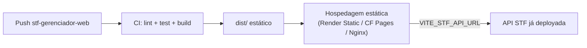

# Deploy

Alinhado ao **mesmo padrão operacional** do STF — PaaS + PostgreSQL gerenciado + HTTPS.

---

## Visão por artefato

| Artefato | Repositório | Como o STF trata hoje | Gerenciador |
|----------|-------------|----------------------|-------------|
| API NestJS | STF | Railway, Fly, Render ou VM | **Mesma instância** — não deploy separado |
| PostgreSQL | STF | Neon, Railway, Render, RDS… | **Mesmo banco** |
| App mobile | STF | **EAS Build** (Expo) | N/A |
| Painel admin web | Gerenciador | — | **Build estático** (Vite → `dist/`) |

> EAS aplica-se só ao mobile. O gerenciador publica **HTML/JS/CSS estáticos** na mesma filosofia de simplicidade operacional (um PaaS ou CDN).

---

## Pipeline sugerido — gerenciador web



| Etapa | Detalhe |
|-------|---------|
| Build | `npm run build` → pasta `dist/` |
| Env produção | `VITE_STF_API_URL=https://api.seudominio...` (injetado no CI) |
| HTTPS | Obrigatório (LGPD) |
| CORS | Configurar origem do admin na API STF |

---

## CORS (STF backend)

Implementado em `senior-test-funcional/backend/src/main.ts`. Configure no deploy:

```env
CORS_ORIGINS=http://localhost:5173,https://admin.seudominio.exemplo
```

Split por vírgula. Dev Vite usa porta **5173** por padrão.

---

## Domínios (exemplo)

| Serviço | Subdomínio exemplo |
|---------|-------------------|
| API | `api.stf.exemplo.com` |
| Admin web | `admin.stf.exemplo.com` |
| Mobile | App stores / Expo Go (dev) |

Domínio próprio continua **fora de escopo TCC** conforme [project-decisions.md](../../senior-test-funcional/docs/engineering/project-decisions.md) — usar URLs dos PaaS até decisão contrária.

---

## Checklist pré-produção

- [ ] API STF em HTTPS
- [ ] `JWT_ACCESS_SECRET` forte (não dev default)
- [x] Admin seed com `role = ADMIN` (`prisma db seed`)
- [x] Audit log habilitado (GW010 — API)
- [ ] CORS com origem do gerenciador (configurar `CORS_ORIGINS` no deploy)
- [ ] `VITE_STF_API_URL` apontando para API de produção
- [ ] Revisão LGPD institucional ([privacy-and-lgpd.md](../../senior-test-funcional/docs/product/privacy-and-lgpd.md))

---

## Referências STF

- [senior-test-funcional/docs/engineering/architecture.md §9](../../senior-test-funcional/docs/engineering/architecture.md)
- [senior-test-funcional/docs/product/privacy-and-lgpd.md §8](../../senior-test-funcional/docs/product/privacy-and-lgpd.md)
