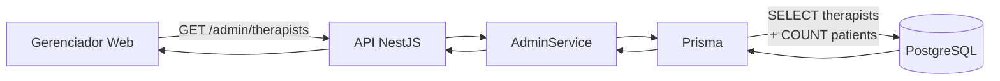
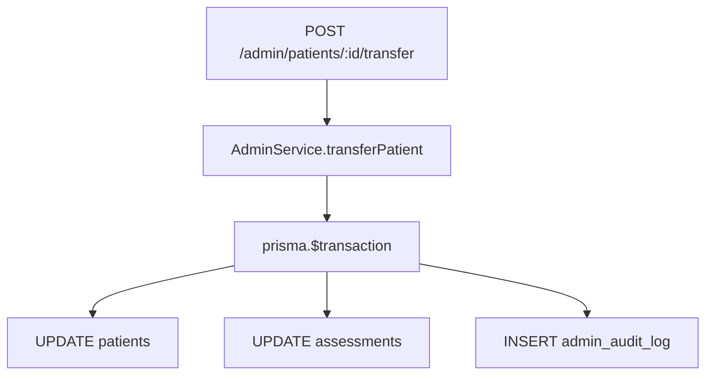

# Integração com senior-test-funcional

Como o gerenciador web se conecta ao monorepo STF existente.

**Status API admin:** ✅ implementada (2026-08-18) — [../contracts/admin-api.md](../contracts/admin-api.md)

---

## Repositórios

```
myProjects/
├── senior-test-funcional/     # Mobile + API + PostgreSQL + docs clínicos
│   ├── backend/               # NestJS — AdminModule ✅
│   ├── frontend/              # Expo — app fisio comum
│   └── docs/                  # Especificação produto base
│
└── stf-gerenciador-web/       # Este repo — docs + frontend Vite (pendente)
    └── docs/
```

---

## O que reutilizar (sem duplicar)

| Componente STF | Uso no gerenciador |
|----------------|-------------------|
| `POST /auth/login` | Login admin — validar `user.role === ADMIN` |
| `GET/DELETE/POST /admin/*` | Todas as operações administrativas |
| Modelo `Therapist`, `Patient`, `Assessment` | Leitura e mutações via admin |
| `ReportsService.generateAssessmentReportForAdmin` | PDF GW009 |
| Scoring / finalize | **Não usado** — admin não aplica testes |
| OpenAPI / Swagger | Tag `admin` em `/api/docs` |

---

## Rotas da API

### Escopo fisioterapeuta (app mobile — inalterado)

| Método | Rota | RF |
|--------|------|-----|
| POST | `/auth/login`, `/auth/register`, RF003… | RF001–RF003 |
| GET/POST/PATCH | `/patients/*` | RF004–RF006 |
| POST/PATCH | `/assessments/*` | RF007–RF011 |
| POST | `/reports/assessments/:id` | RF013 (com ownership) |
| GET | `/instruments` | RF007 |

### Escopo admin (gerenciador web)

| Método | Rota | GW | STF |
|--------|------|-----|-----|
| GET | `/admin/therapists` | GW002 | ✅ |
| GET | `/admin/therapists/:id` | GW003 | ✅ |
| DELETE | `/admin/therapists/:id` | GW006 | ✅ |
| GET | `/admin/patients/:id` | GW007 | ✅ |
| GET | `/admin/patients/:id/assessments` | GW008 | ✅ |
| GET | `/admin/patients/:id/assessments/:assessmentId` | GW007 | ✅ |
| GET | `/admin/patients/:id/instruments/:code/timeseries` | GW008 | ✅ |
| DELETE | `/admin/patients/:id` | GW004 | ✅ |
| POST | `/admin/patients/:id/transfer` | GW005 | ✅ |
| POST | `/admin/reports/assessments/:assessmentId` | GW009 | ✅ |
| GET | `/admin/audit-logs` | GW010 | ✅ |

Detalhe request/response: [../contracts/admin-api.md](../contracts/admin-api.md)

---

## Código no STF (`backend/src/admin/`)

```
admin/
├── admin.module.ts
├── admin.controller.ts      # todas as rotas /admin/*
├── admin.service.ts
├── admin.guard.ts
├── admin-audit.service.ts
└── schemas/admin.schemas.ts
```

Relatórios admin delegam a `ReportsService.generateAssessmentReportForAdmin` em `reports/reports.service.ts`.

Schema e migration: [data-model-extensions.md](data-model-extensions.md) · migration `20260818180000_add_admin_role_and_audit_log`.

---

## Auth

- JWT inclui `role`; `JwtStrategy` **revalida** role no banco a cada request
- `AdminGuard` → 403 `"Acesso restrito a administradores."`
- Seed dev: `npx prisma db seed` — `admin@clinica.exemplo` / `Admin1234` (configurável via `ADMIN_SEED_*`)

---

## Fluxo de dados — leitura



---

## Fluxo de dados — transferência



---

## Impacto no app mobile

| Área | Impacto |
|------|---------|
| Telas / fluxos | **Nenhum** |
| Endpoints fisio | **Inalterados** |
| Pós-transferência | Paciente some/aparece conforme novo `therapist_id` |
| JWT com `role` | App ignora — fisio continua `THERAPIST` |

Teste regressão: `backend/test/admin.e2e-spec.ts`.

---

## Ambiente de desenvolvimento

```bash
# Terminal 1 — STF
cd ../senior-test-funcional
make migrate
cd backend && npx prisma db seed
make start-backend

# Terminal 2 — gerenciador (quando existir frontend/)
cd ../stf-gerenciador-web
cp .env.example .env
npm run dev
```

| Check | URL / comando |
|-------|----------------|
| Health | http://localhost:3000/health |
| Swagger tag admin | http://localhost:3000/api/docs |
| API URL no front | `VITE_STF_API_URL=http://localhost:3000` |
| CORS dev | `CORS_ORIGINS=http://localhost:5173` no `backend/.env` STF |

---

## Versionamento e contrato

| Prática | Detalhe |
|---------|---------|
| OpenAPI | Tag `admin` no Swagger STF |
| Breaking changes | Evitar em rotas fisio; admin é aditivo |
| Tipos no gerenciador | `openapi-typescript` a partir de `/api/docs-json` |

---

## Referências STF

- [backend/README.md](../../senior-test-funcional/docs/backend/README.md)
- [data-model.md](../../senior-test-funcional/docs/engineering/data-model.md)
- [architecture.md](../../senior-test-funcional/docs/engineering/architecture.md)
- [gap-analysis-stf.md](gap-analysis-stf.md)
