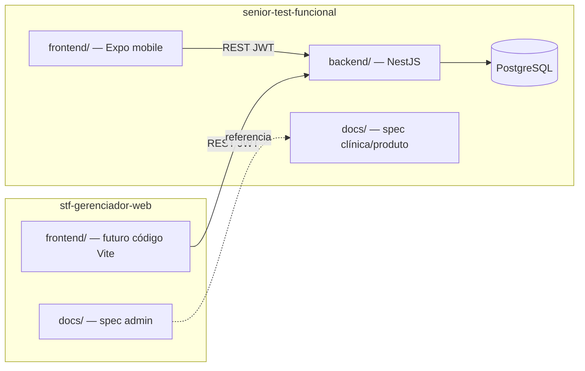

# Vínculo com senior-test-funcional

Este repositório é **separado**, mas **conhece** e depende do monorepo STF.

---

## Caminhos

| Repositório | Caminho local (padrão) | Papel |
|-------------|------------------------|-------|
| **STF (mobile + API)** | `../senior-test-funcional` | Produto base, API, banco, docs clínicas |
| **Gerenciador web** | `.` (este repo) | Painel admin, docs administrativas |

Ajuste o caminho relativo se seus clones estiverem em outra estrutura — o importante é manter **um único PostgreSQL** e **uma única API** em runtime.

---

## O que vive onde



| Artefato | Repositório |
|----------|-------------|
| Regras clínicas, RFs RF001–RF013 | STF |
| AdminModule, `role`, audit log, migrations | STF (`backend/`) |
| Telas admin, tema web adaptado | Gerenciador |
| PRD e regras GW001–GW010 | Gerenciador (`docs/`) |
| OpenAPI canônico | STF (`/api/docs`) |

---

## Desenvolvimento local

```bash
# Terminal 1 — STF (API + Postgres)
cd ../senior-test-funcional
make setup    # primeira vez
make start-backend   # ou make start

# Terminal 2 — Gerenciador (quando existir frontend/)
cd ../stf-gerenciador-web
cp .env.example .env
npm install
npm run dev
```

| Check | Comando |
|-------|---------|
| API saudável | `curl http://localhost:3000/health` |
| Swagger (tag admin) | http://localhost:3000/api/docs |
| Seed admin (1ª vez) | `cd ../senior-test-funcional/backend && npx prisma db seed` |
| Login admin default | `admin@clinica.exemplo` / `Admin1234` |
| URL no gerenciador | `VITE_STF_API_URL=http://localhost:3000` |

---

## Contrato API

1. Swagger vivo: `{VITE_STF_API_URL}/api/docs`
2. Gerar tipos TypeScript (script futuro em `package.json`):

```bash
# Exemplo — ajustar quando scaffold existir
npx openapi-typescript http://localhost:3000/api/docs-json -o src/api/schema.d.ts
```

3. Endpoints **admin** (`/admin/*`) serão adicionados no STF — ver [gap-analysis-stf.md](gap-analysis-stf.md)

---

## Documentação cruzada

| Preciso de… | Onde ler |
|-------------|----------|
| Instrumentos, scoring, PDF RF013 | [senior-test-funcional/docs/](../../senior-test-funcional/docs/README.md) |
| Modelo de dados base | [senior-test-funcional/docs/engineering/data-model.md](../../senior-test-funcional/docs/engineering/data-model.md) |
| Comportamento API | [senior-test-funcional/docs/backend/README.md](../../senior-test-funcional/docs/backend/README.md) |
| Tokens visuais mobile | [senior-test-funcional/frontend/src/theme/tokens.ts](../../senior-test-funcional/frontend/src/theme/tokens.ts) |
| Decisões TCC (e-mail, domínio) | [senior-test-funcional/docs/engineering/project-decisions.md](../../senior-test-funcional/docs/engineering/project-decisions.md) |
| Escopo admin | [docs/product/](../product/) neste repo |

---

## Fase do produto

| Componente | Fase |
|------------|------|
| STF mobile + API | **Produto real** entregue — pós-MVP, integração concluída |
| Gerenciador web | **Complemento necessário** para administrar dados gerados no mobile |

O PRD original do STF listava “módulo web gerencial” como fora do MVP — este repositório **materializa** essa peça pendente.

---

## Regra para agentes e contribuidores

- **Não duplicar** domínio clínico neste repo — consultar STF  
- **Não alterar** regras de scoring/PDF no gerenciador  
- Mudanças de schema/banco → PR no **STF**  
- Mudanças de UI admin → PR no **gerenciador**
