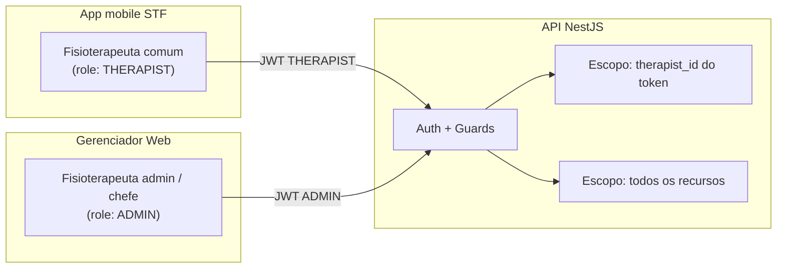

# Personas e papéis

## Visão geral de papéis

---

## Persona primária: Fisioterapeuta administrador (chefe)

| Atributo | Descrição |
|----------|-----------|
| **Quem é** | Responsável pela coordenação/supervisão da equipe — **único usuário do painel web** |
| **Canal** | Gerenciador web (desktop) **apenas** — conta separada do app mobile STF |
| **Motivação** | Supervisionar carga de trabalho, redistribuir pacientes, garantir continuidade do cuidado |
| **Conhecimento técnico** | Moderado — usa sistemas web no dia a dia |
| **Frequência** | Semanal ou conforme necessidade (não aplica testes pelo painel) |

### Objetivos

- Saber quantos pacientes cada fisio acompanha
- Transferir paciente quando um colega está ausente
- Remover cadastros duplicados ou obsoletos
- Acessar relatórios para revisão ou arquivo institucional

### Frustrações (sem o gerenciador)

- Não consegue ver pacientes de outros colegas no app
- Não pode mover paciente entre fisios sem intervenção manual no banco
- PDF bloqueado para pacientes que não são seus

---

## Persona secundária: Fisioterapeuta comum

| Atributo | Descrição |
|----------|-----------|
| **Quem é** | Profissional de linha que aplica testes e acompanha seus pacientes |
| **Canal** | App mobile STF (Expo) |
| **Papel no gerenciador** | **Não é usuário** — continua exclusivamente no mobile |
| **Escopo de dados** | Apenas pacientes onde `patient.therapist_id = seu id` |

> O fisio comum pode ser promovido a admin via seed/migration ou update direto no banco — seed dev: `npx prisma db seed` no STF.

---

## Modelo de autorização proposto

| Role | Valor | App mobile | Gerenciador web | Escopo API |
|------|-------|------------|-----------------|------------|
| `THERAPIST` | padrão atual | ✅ | ❌ | Próprios pacientes/avaliações |
| `ASSISTANT` | novo (ajudante) | ❌ | ✅ | Gerencia apenas THERAPIST (comuns) + seus pacientes; vê a trilha de auditoria (somente leitura) |
| `ADMIN` | novo (professora, conta única) | ❌ (ou ✅ read-only futuro) | ✅ | Gerencia ASSISTANT + THERAPIST; aprova/rejeita solicitações de acesso. Conta criada/recuperada/trocada só via `npm run admin:set` no backend |

### Matriz de permissões (MVP)

| Ação | THERAPIST (mobile) | ADMIN (web) |
|------|-------------------|-------------|
| Listar próprios pacientes | ✅ | ✅ (todos) |
| Cadastrar paciente | ✅ | ❌ MVP |
| Aplicar teste | ✅ | ❌ |
| Ver histórico próprio paciente | ✅ | ✅ (qualquer) |
| PDF própria avaliação | ✅ | ✅ (qualquer) |
| Listar fisioterapeutas | ❌ | ✅ |
| Excluir paciente | ❌* | ✅ |
| Transferir paciente | ❌ | ✅ |
| Excluir fisioterapeuta | ❌ | ✅ |

\* Fisio comum pode ter exclusão de **seus** pacientes no app — comportamento existente RF004/RF005; admin exclui **qualquer** paciente.

---

## Distinção: admin clínico vs operador de sistema

| Papel | Descrição |
|-------|-----------|
| **Admin clínico (este PRD)** | Fisioterapeuta chefe com credenciais STF e role `ADMIN` |
| **Operador de infra** | DevOps / hospedagem — **fora** do gerenciador; acesso direto ao banco e servidores |

O gerenciador trata o admin como **usuário de negócio**, não como superusuário técnico.

---

## LGPD — implicações por papel

| Papel | Tratamento de dados |
|-------|---------------------|
| Fisio comum | Operador assistencial — dados dos **seus** pacientes |
| Admin | Acesso ampliado por **necessidade de supervisão** — exige base legal e registro (ver [business-rules.md](../domain/business-rules.md)) |

Referência: [senior-test-funcional/docs/product/privacy-and-lgpd.md](../../senior-test-funcional/docs/product/privacy-and-lgpd.md)
